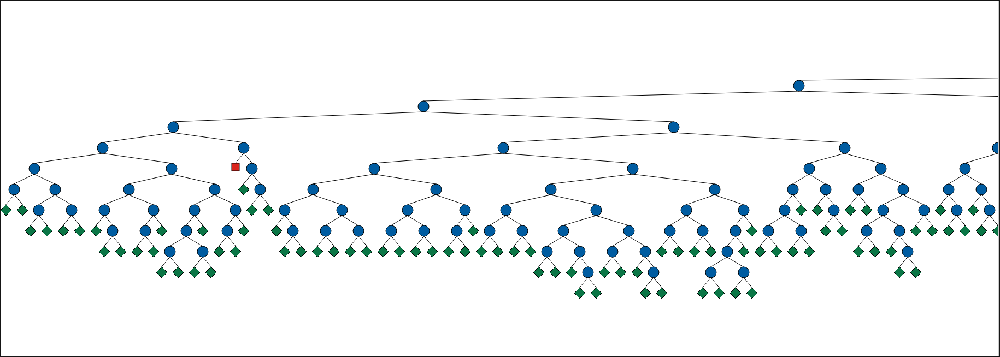
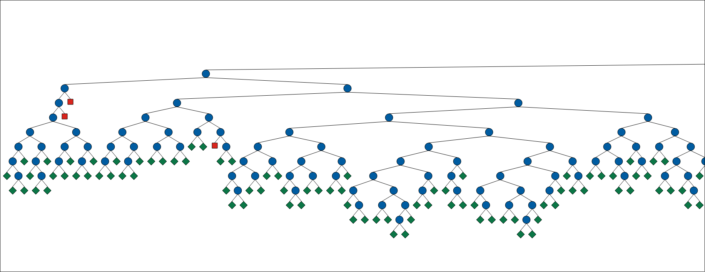
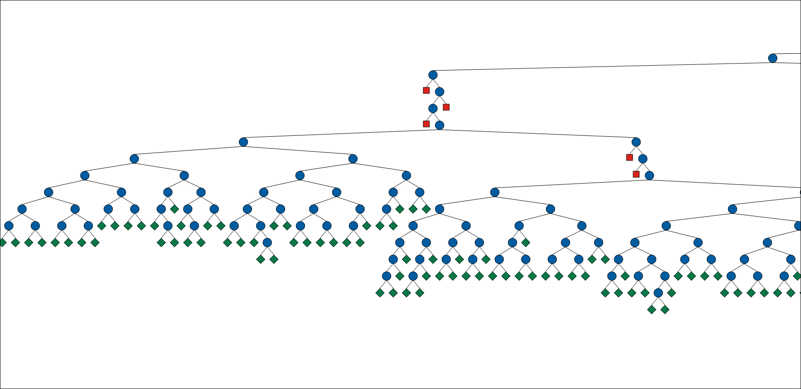
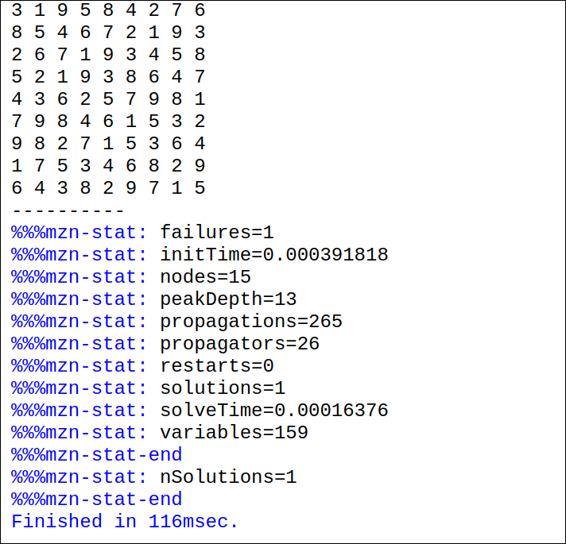
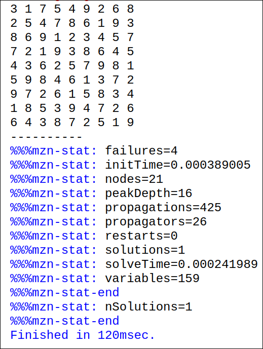
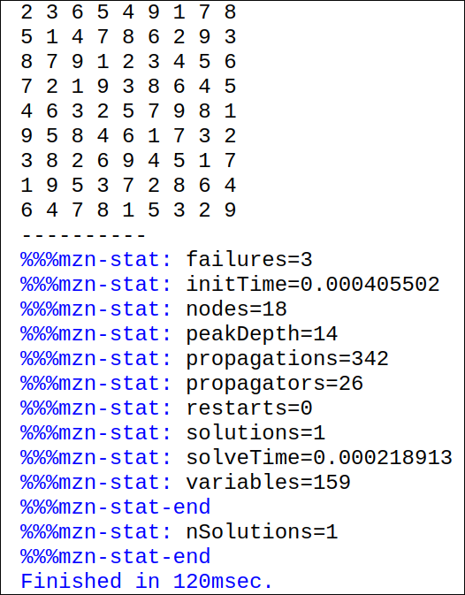

# Modelado del Sudoku como un Problema de Satisfacción de Restricciones (CSP)

**Autor(es):** Juan Manuel Arango Y Alex Garcia Castañeda
**Fecha:** Marzo 2025  
**Curso:** Programación por Restricciones  
**Profesor:** Carlos Andrés Delgado S

---

## 1. Introducción

El Sudoku es un rompecabezas lógico basado en números, donde el objetivo es completar una cuadrícula de $9 \times 9$ asegurando que cada fila, columna y subcuadrícula de $3 \times 3$ contenga los números del 1 al 9 sin repeticiones. En este informe, se modela el Sudoku como un Problema de Satisfacción de Restricciones (CSP) utilizando **MiniZinc**, y se analizan distintas estrategias de búsqueda para comparar su eficiencia.

---

## 2. Modelado del Problema como un CSP

El Sudoku se puede formular como un CSP con las siguientes características:

### 2.1. Variables

- $grid[i,j]$: Representa el número en la posición $(i,j)$ de la cuadrícula de $9 \times 9$.
- Algunas casillas tienen valores predefinidos según la instancia del problema.

### 2.2. Dominios

- Cada variable $grid[i,j]$ puede tomar un valor dentro del conjunto: $$\{1,2,3,4,5,6,7,8,9\}$$

### 2.3. Restricciones

1. **Unicidad en filas:** Cada fila debe contener los números del 1 al 9 sin repeticiones:
   $$\forall i∈{1,…,9},  alldifferent({grid[i,j]∣j∈{1,…,9}})$$
2. **Unicidad en columnas:** Cada columna debe cumplir la misma restricción: $$\forall j∈{1,…,9}, alldifferent({grid[i,j]∣ i∈{1,…,9}})$$
3. **Unicidad en subcuadrículas:** Cada bloque de $3 \times 3$ debe contener los números del 1 al 9 sin repeticiones:
   $$\forall r, c \in \{0, 1, 2\}, \quad \text{alldifferent}(\{ grid[i, j] \mid i \in 3r+1..3r+3, j \in 3c+1..3c+3 \})$$
4. **Casillas predefinidas:** Algunas casillas tienen valores fijos establecidos en la entrada.

---

## 3. Implementación en MiniZinc

El siguiente código en **MiniZinc** modela el Sudoku y aplica las restricciones necesarias:

```minizinc
include "alldifferent.mzn"; % Se incluye la librería que permite aplicar la restricción de valores únicos.

int: n = 9; % Tamaño de la cuadrícula (9x9 para Sudoku).
set of int: DOMAIN = 1..9; % Define que los valores permitidos son del 1 al 9.

array[1..n, 1..n] of var DOMAIN: grid; % Se declara una matriz de variables donde cada celda contendrá un valor entre 1 y 9.

constraint forall(i in 1..n) (
    alldifferent([grid[i, j] | j in 1..n]) % Garantiza que los valores en cada fila sean distintos.
);

constraint forall(j in 1..n) (
    alldifferent([grid[i, j] | i in 1..n]) % Garantiza que los valores en cada columna sean distintos.
);

constraint forall(r in 0..2, c in 0..2) (
    alldifferent([grid[i, j] | i in 3*r+1..3*r+3, j in 3*c+1..3*c+3]) % Garantiza que los valores en cada subcuadrícula 3x3 sean distintos.
);

solve :: int_search(grid, first_fail, complete) satisfy; % Estrategia de búsqueda: prioriza variables con menos opciones para acelerar la resolución.

output [ show(grid[i, j]) ++ if j == n then "\n" else " " endif | i in 1..n, j in 1..n ]; % Imprime la cuadrícula solucionada con formato adecuado.
```

---

## 4 Estrategias de Distribución Evaluadas

En MiniZinc, la distribución de valores en las variables puede influir significativamente en el rendimiento de la resolución del problema. Se probaron las siguientes estrategias:

---

#### 1. `first_fail`

Selecciona primero la variable con el dominio más pequeño, lo que ayuda a reducir rápidamente el espacio de búsqueda al priorizar aquellas que tienen menos opciones disponibles. Esto permite disminuir la cantidad de decisiones erróneas y mejorar la eficiencia de la búsqueda.



#### 2. `smallest`

Prioriza la asignación de valores a las variables con los valores más pequeños dentro de su dominio. Esta estrategia es útil cuando se busca encontrar soluciones rápidamente, pero puede generar un mayor número de retrocesos si no se combina con otras heurísticas.


#### 3. `input_order`

Prioriza la asignación de valores a las variables con los valores más pequeños dentro de su dominio. Esta estrategia es útil cuando se busca encontrar soluciones rápidamente, pero puede generar un mayor número de retrocesos si no se combina con otras heurísticas.


---

## 5. Estrategias de Búsqueda y Resultados

Se evaluaron tres estrategias de búsqueda en MiniZinc:

| Estrategia    | Tiempo de Ejecución | Iteraciones | Observaciones                                                                    |
| ------------- | ------------------- | ----------- | -------------------------------------------------------------------------------- |
| `first_fail`  | 0.00016 s           | 17          | Encontró la solución rápidamente con pocas iteraciones, optimizando la búsqueda. |
| `smallest`    | 0.00025 s           | 24          | Realizó más iteraciones que `first_fail`, pero aún así fue eficiente.            |
| `input_order` | 0.00022 s           | 18          | Similar a `first_fail`, aunque sin aplicar heurísticas avanzadas.                |

---

## 6. Evidencias de Ejecución

### `first_fail`



### `smallest`



### `input_order`



## 7. Conclusiones

El modelado del Sudoku como un CSP permitió encontrar soluciones de manera eficiente utilizando MiniZinc. A partir de la experimentación con distintas estrategias de búsqueda, se concluye que:

- **El método `first_fail` mostró el mejor rendimiento**, al priorizar las variables más restringidas y reducir el número de iteraciones necesarias para encontrar una solución.
- **Las restricciones `alldifferent` son fundamentales**, ya que garantizan la validez del Sudoku al evitar repeticiones en filas, columnas y regiones. Sin embargo, pueden incrementar la complejidad computacional si no se gestionan adecuadamente.
- **El uso de diferentes estrategias de búsqueda influye en la eficiencia del proceso**, con `smallest` ofreciendo un equilibrio entre exploración y rapidez, mientras que `input_order` puede ser menos eficiente al no aplicar heurísticas avanzadas.

En general, la resolución del Sudoku mediante CSP y MiniZinc ofrece un enfoque estructurado y flexible, permitiendo explorar distintas estrategias para mejorar el desempeño en la búsqueda de soluciones.

